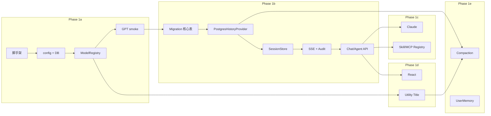

# Phase 1 任务清单

> 基于 [ARCHITECTURE.md](./ARCHITECTURE.md) v0.6 拆解的可执行任务。
>
> 状态：待启动 · 更新：2026-06-06

---

## 0. 方案 Review 摘要

### 0.1 与当前环境对齐情况

| 项 | 状态 | 说明 |
|----|------|------|
| 主对话模型 GPT | ✅ 已配置 | `AZURE_*` → `gpt-5.4` |
| Utility 模型 | ✅ 已配置 | `UTILITY_MODEL_*` → `gpt-4o-mini`（标题/压缩） |
| Claude | ✅ 已配置 | `CLAUDE_AZURE_FOUNDRY_ENDPOINT` 为 `/anthropic` base（正确） |
| PostgreSQL | ✅ 已配置 | Neon `DATABASE_URL` |
| Redis | ✅ 已配置 | `REDIS_URL` |
| DeepSeek | ⏸ Phase 1 不做 | 方案中保留，实施放在 Phase 2b |
| 代码仓库 | 🔲 空 | 仅 `docs/` + `.env`，需从 1a 脚手架开始 |

### 0.2 方案成熟度评估

| 维度 | 评分 | 备注 |
|------|------|------|
| 架构分层 | 高 | Platform / MAF / Storage 边界清晰 |
| 记忆与历史 | 高 | Session + HistoryProvider + 全类型 message 已定义 |
| Skill / MCP | 中高 | MAF 原生能力明确，Registry 待实现 |
| 前端协议 | 中 | AG-UI 路径清晰，具体客户端选型 1d 再定 |
| Cancel/Stop | 高（设计） | 已归 Phase 2，不阻塞 Phase 1 |

### 0.3 Review 后微调建议（已写入 ARCHITECTURE v0.6）

1. **env 变量表**与 workspace `.env` 对齐（`UTILITY_MODEL_API_KEY` 等）。
2. **Claude base_url** 文档改为 `.../anthropic`，避免误配 `/v1/messages`。
3. **`.env` 行尾注释**可能导致解析问题——`config.py` 用 pydantic-settings 或 strip 处理。
4. **Phase 1 里程碑**：先完成 **MVP-α（1a+1b）** 再并行 1c/1d，降低集成风险。

### 0.4 Phase 1 范围边界

**做**

- Python `backend/` + React `frontend/` 目录
- GPT 主模型对话（流式 + 多轮 + DB 持久化）
- Claude 接入（Agent 可选模型）
- MCP / Tool / Skill 基础 Registry + 单 Agent 挂载
- messages 全类型（含 reasoning / mcp / skill）
- Utility：`ChatTitleService`（1d）、`HistoryCompactionService`（1e）
- 基础用户 / Agent / Chat CRUD

**不做（明确排除）**

- Streaming Cancel / Stop（Phase 2a）
- A2A / Workflow 编排（Phase 2b）
- DeepSeek、Mem0、RAG
- Tool Result Slim（接口预留，Phase 1 透传）
- `CompactionProvider` 完整管线（Phase 1e 再启）
- 生产级 Auth（Phase 1 可用固定 test user 或简单 API key）

---

## 1. 里程碑定义

```
MVP-α   Phase 1a + 1b     后端：GPT 流式多轮 + DB/Redis + REST
MVP-β   + 1c 核心         Claude + 1 个 Skill + 1 个 MCP 验证
MVP-γ   + 1d              React 聊天 UI + 标题生成
RC      + 1e              压缩 + 长期记忆 + 观测
```

| 里程碑 | 验收场景 |
|--------|----------|
| **MVP-α** | `curl` 创建 chat → 发 3 轮消息 → DB 有完整 messages → 第 3 轮能引用第 1 轮内容 |
| **MVP-β** | 切换 Agent 为 Claude；`load_skill` 与 postgres MCP 各成功一次并落库 |
| **MVP-γ** | 浏览器流式聊天；首轮后 chat 列表出现 Utility 生成的标题 |
| **RC** | 超长对话触发压缩；`chats.summary` 更新；reasoning 与 text UI 分轨 |

---

## 2. 依赖关系



---

## 3. Phase 1a — 基础骨架（预估 3–5 天）

### 1a-01 仓库初始化

| 字段 | 内容 |
|------|------|
| **产出** | `backend/`、`frontend/` 目录；`.gitignore` |
| **文件** | `.gitignore`（`.env`、`__pycache__`、`.venv`、`node_modules`） |
| **验收** | 目录结构与 ARCHITECTURE §3 一致；`.env` 不被 git 跟踪 |

### 1a-02 Backend 依赖与入口

| 字段 | 内容 |
|------|------|
| **产出** | 可启动的 FastAPI 应用 |
| **文件** | `backend/pyproject.toml`、`backend/app/main.py`、`backend/app/config.py` |
| **依赖** | `agent-framework`、`fastapi`、`uvicorn`、`python-dotenv`、`pydantic-settings`、`sqlalchemy`、`asyncpg`、`alembic`、`redis` |
| **验收** | `uvicorn app.main:app` 启动；`GET /health` 返回 200 |

### 1a-03 配置加载（对齐 .env）

| 字段 | 内容 |
|------|------|
| **产出** | `Settings` 单例，读取全部 env |
| **映射** | 见 §4 环境变量清单 |
| **验收** | 启动时打印（脱敏）模型 deployment 名称；Utility 与主模型 deployment 可区分 |

### 1a-04 数据库连接骨架

| 字段 | 内容 |
|------|------|
| **产出** | SQLAlchemy async engine + session factory |
| **文件** | `backend/app/db/session.py` |
| **验收** | 启动时 `SELECT 1` 成功（Neon） |

### 1a-05 Redis 连接骨架

| 字段 | 内容 |
|------|------|
| **产出** | Redis 客户端（`redis.asyncio`） |
| **文件** | `backend/app/db/redis.py` 或 `session_store.py` 内 |
| **验收** | `PING` 成功 |

### 1a-06 Alembic 初始化

| 字段 | 内容 |
|------|------|
| **产出** | `alembic.ini`、`alembic/env.py` 接入 async URL |
| **验收** | `alembic current` 可执行 |

### 1a-07 ModelRegistry + GPT 冒烟

| 字段 | 内容 |
|------|------|
| **产出** | `platform/model_registry.py`；CLI 或 `/health/models` 探测 |
| **验收** | `AzureOpenAIChatClient` + `agent.run("hello")` 非流式返回文本 |

### 1a-08 UtilityModelRegistry 冒烟

| 字段 | 内容 |
|------|------|
| **产出** | `platform/utility_models.py` |
| **验收** | `complete(CHAT_TITLE, prompt="...")` 使用 `gpt-4o-mini` 返回短字符串 |

---

## 4. Phase 1b — 对话与持久化（预估 5–8 天）

> **目标**：达成 **MVP-α**

### 1b-01 Migration：核心表 v1

| 字段 | 内容 |
|------|------|
| **表** | `users`、`agents`、`chats`、`messages` |
| **文件** | `alembic/versions/001_core_tables.py`、`db/models.py` |
| **验收** | `alembic upgrade head` 在 Neon 成功 |

### 1b-02 种子数据 / 开发用户

| 字段 | 内容 |
|------|------|
| **产出** | 固定 dev user + 默认 Agent（GPT / instructions 模板） |
| **验收** | 迁移或 startup hook 可重复执行（idempotent） |

### 1b-03 PostgresHistoryProvider

| 字段 | 内容 |
|------|------|
| **产出** | `memory/postgres_history.py` |
| **要点** | `get_messages` / `save_messages`；`to_maf_messages()` 全类型；reasoning → `TextReasoningContent` |
| **验收** | 单元测试：round-trip DB row ↔ MAF Message |

### 1b-04 ToolSlimmer 接口（透传）

| 字段 | 内容 |
|------|------|
| **产出** | `memory/slimmer.py`：`PassthroughToolSlimmer`、`HistoryProjection` |
| **验收** | `project_for_cache` 输入等于输出 |

### 1b-05 SessionStore

| 字段 | 内容 |
|------|------|
| **产出** | `platform/session_store.py` |
| **要点** | Redis `session:{chat_id}`；DB `chats.session_state` 双写 |
| **验收** | 重启进程后同一 chat 多轮记忆仍在 |

### 1b-06 AgentFactory（最小版）

| 字段 | 内容 |
|------|------|
| **产出** | `platform/agent_factory.py` |
| **要点** | 从 `agents` 表构建 MAF `Agent`；`require_per_service_call_history_persistence=True` |
| **验收** | 按 agent_id 构建实例；配置不变时可复用 |

### 1b-07 Audit Middleware

| 字段 | 内容 |
|------|------|
| **产出** | `middleware/audit.py` |
| **要点** | 拦截 tool/mcp/skill；写 `messages`（含 `parent_id`、`sequence`） |
| **验收** | 带 tool 的 run 后 DB 有成对 call/result 行 |

### 1b-08 流式消息管道

| 字段 | 内容 |
|------|------|
| **产出** | `api/routes/chats.py` 或 `services/chat_run.py` |
| **要点** | SSE；解析 `TextReasoningContent` vs text；结束后 `get_final_response()` |
| **验收** | 流式输出 + DB 落库 reasoning/text 分行 |

### 1b-09 REST API（核心）

| 端点 | 说明 |
|------|------|
| `POST /api/v1/users` | 创建用户（或 dev 单用户跳过） |
| `POST /api/v1/agents` | 创建 Agent |
| `GET /api/v1/agents` | 列表 |
| `POST /api/v1/chats` | 创建 chat（绑定 agent_id） |
| `GET /api/v1/chats/{id}/messages` | 历史消息 |
| `POST /api/v1/chats/{id}/messages` | 非流式（调试） |
| `POST /api/v1/chats/{id}/stream` | SSE 流式 |

**验收**：Postman / curl 完成 MVP-α 场景。

---

## 5. Phase 1c — 能力扩展（预估 5–7 天）

> **目标**：达成 **MVP-β**

### 1c-01 Migration：资源表

| 表 | `tools`、`mcp_servers`、`skills`、`agent_tools`、`agent_mcp_servers`、`agent_skills` |
|----|---|

### 1c-02 Claude ModelRegistry

| 字段 | 内容 |
|------|------|
| **配置** | `CLAUDE_AZURE_*`；`AnthropicClient(base_url=..., model=...)` |
| **验收** | Agent `model_provider=azure_anthropic` 可对话 |

### 1c-03 ToolRegistry

| 字段 | 内容 |
|------|------|
| **验收** | 注册示例 `@tool`；Agent 挂载后可调用并审计 |

### 1c-04 McpRegistry

| 字段 | 内容 |
|------|------|
| **验收** | 至少 1 个 `MCPStdioTool`（如 postgres）或 `MCPStreamableHTTPTool` 可连接 |

### 1c-05 SkillRegistry

| 字段 | 内容 |
|------|------|
| **产出** | `platform/skill_registry.py`；`backend/app/skills/<name>/SKILL.md` 样例 |
| **验收** | `load_skill` 事件落库；Agent 能按 skill 指令回答 |

### 1c-06 Agent 配置 API 增强

| 字段 | 内容 |
|------|------|
| **端点** | Agent 绑定 tool/mcp/skill IDs |
| **验收** | 不同 Agent 共享同一 tool 定义、不同 skill 子集 |

---

## 6. Phase 1d — 前端（预估 5–7 天）

> **目标**：达成 **MVP-γ**

### 1d-01 Frontend 脚手架

| 字段 | 内容 |
|------|------|
| **产出** | Vite + React + TS + Tailwind |
| **验收** | `npm run dev` 可访问 |

### 1d-02 API 客户端

| 字段 | 内容 |
|------|------|
| **产出** | `src/api/client.ts`、SSE 消费封装 |
| **验收** | 能调通 backend `/stream` |

### 1d-03 聊天页

| 字段 | 内容 |
|------|------|
| **组件** | `Chat.tsx`、消息列表、输入框 |
| **要点** | `message_type=reasoning` 折叠；`text` 正常气泡；tool/skill 事件卡片 |
| **验收** | 流式打字效果；多轮上下文正确 |

### 1d-04 Agent 配置页（基础）

| 字段 | 内容 |
|------|------|
| **验收** | 可选模型（GPT/Claude）、编辑 instructions |

### 1d-05 Chat 列表 + 标题

| 字段 | 内容 |
|------|------|
| **产出** | `ChatTitleService` 首轮后 async 调 Utility |
| **验收** | 新对话默认「New Chat」→ 首轮完成后标题更新 |

### 1d-06 AG-UI（可选替代路径）

| 字段 | 内容 |
|------|------|
| **说明** | 若自研 SSE 够用可延后；否则 `add_agent_framework_fastapi_endpoint` + CopilotKit |
| **决策点** | 1d-03 完成后评估 |

---

## 7. Phase 1e — 记忆与打磨（预估 3–5 天）

> **目标**：**RC**

### 1e-01 UserMemoryContextProvider

| 字段 | 内容 |
|------|------|
| **表** | `user_memories` migration |
| **验收** | 跨 chat 注入用户偏好（手动写入记忆可测） |

### 1e-02 HistoryCompactionService

| 字段 | 内容 |
|------|------|
| **模型** | `UTILITY_MODEL_*` / `history_compaction` |
| **要点** | 摘要时剥离 `reasoning` 正文 |
| **验收** | 超长 fixture 对话生成 `chats.summary` |

### 1e-03 CompactionProvider 接入

| 字段 | 内容 |
|------|------|
| **要点** | `summarizer_client` ← Utility；`TokenBudgetComposedStrategy` |
| **验收** | 超阈值后新 run 不再 context overflow |

### 1e-04 观测与错误处理

| 字段 | 内容 |
|------|------|
| **产出** | 结构化日志；基础 OTel span（`agent.run`） |
| **验收** | 模型/API 失败返回明确错误 message_type=`error` |

---

## 8. 环境变量清单（实施对照）

| 变量 | Phase | 用途 |
|------|-------|------|
| `AZURE_API_KEY` | 1a | 主模型 |
| `AZURE_OPENAI_BASE_URL` | 1a | 主模型 |
| `AZURE_OPENAI_API_VERSION` | 1a | 主模型 |
| `AZURE_OPENAI_DEPLOYMENT` | 1a | 主模型 `gpt-5.4` |
| `UTILITY_MODEL_API_KEY` | 1a | Utility |
| `UTILITY_MODEL_BASE_URL` | 1a | Utility |
| `UTILITY_MODEL_API_VERSION` | 1a | Utility |
| `UTILITY_MODEL_DEPLOYMENT` | 1a | Utility `gpt-4o-mini` |
| `CLAUDE_AZURE_API_KEY` | 1c | Claude |
| `CLAUDE_AZURE_FOUNDRY_ENDPOINT` | 1c | Claude base |
| `CLAUDE_AZURE_FOUNDRY_MODEL` | 1c | Claude 模型 |
| `DATABASE_URL` | 1a | PostgreSQL |
| `REDIS_URL` | 1a | Redis |

---

## 9. 建议执行顺序（本周可启动）

| 顺序 | 任务 ID | 说明 |
|------|---------|------|
| 1 | 1a-01 ~ 1a-06 | 脚手架 + DB/Redis + Alembic |
| 2 | 1a-07 ~ 1a-08 | 主模型 + Utility 冒烟（验证 .env） |
| 3 | 1b-01 ~ 1b-06 | 表 + History + Session + AgentFactory |
| 4 | 1b-07 ~ 1b-09 | Audit + 流式 + REST → **MVP-α** |
| 5 | 1c-* | 与 1d-01 可并行 |
| 6 | 1d-02 ~ 1d-05 | 前端 + 标题 |
| 7 | 1e-* | 压缩与长期记忆 |

---

## 10. 任务状态跟踪

| ID | 任务 | 状态 | 负责人 | 备注 |
|----|------|------|--------|------|
| 1a-01 | 仓库初始化 | ⬜ 待办 | | |
| 1a-02 | FastAPI 入口 | ⬜ 待办 | | |
| 1a-03 | config.py | ⬜ 待办 | | |
| 1a-04 | DB 连接 | ⬜ 待办 | | |
| 1a-05 | Redis 连接 | ⬜ 待办 | | |
| 1a-06 | Alembic init | ⬜ 待办 | | |
| 1a-07 | ModelRegistry 冒烟 | ⬜ 待办 | | |
| 1a-08 | Utility 冒烟 | ⬜ 待办 | | |
| 1b-01 | Migration 核心表 | ⬜ 待办 | | |
| 1b-02 | 种子数据 | ⬜ 待办 | | |
| 1b-03 | PostgresHistoryProvider | ⬜ 待办 | | |
| 1b-04 | Slimmer 透传 | ⬜ 待办 | | |
| 1b-05 | SessionStore | ⬜ 待办 | | |
| 1b-06 | AgentFactory | ⬜ 待办 | | |
| 1b-07 | Audit Middleware | ⬜ 待办 | | |
| 1b-08 | 流式管道 | ⬜ 待办 | | |
| 1b-09 | REST API | ⬜ 待办 | | |
| 1c-01 | 资源表 migration | ⬜ 待办 | | |
| 1c-02 | Claude | ⬜ 待办 | | |
| 1c-03 | ToolRegistry | ⬜ 待办 | | |
| 1c-04 | McpRegistry | ⬜ 待办 | | |
| 1c-05 | SkillRegistry | ⬜ 待办 | | |
| 1c-06 | Agent 配置 API | ⬜ 待办 | | |
| 1d-01 | Frontend 脚手架 | ⬜ 待办 | | |
| 1d-02 | API 客户端 | ⬜ 待办 | | |
| 1d-03 | 聊天页 | ⬜ 待办 | | |
| 1d-04 | Agent 配置页 | ⬜ 待办 | | |
| 1d-05 | ChatTitleService | ⬜ 待办 | | |
| 1e-01 | UserMemory | ⬜ 待办 | | |
| 1e-02 | HistoryCompaction | ⬜ 待办 | | |
| 1e-03 | CompactionProvider | ⬜ 待办 | | |
| 1e-04 | 观测 | ⬜ 待办 | | |

---

*实施过程中在本表更新状态；架构变更回流至 ARCHITECTURE.md。*
