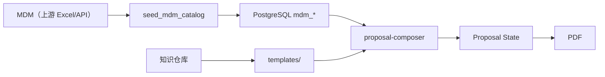
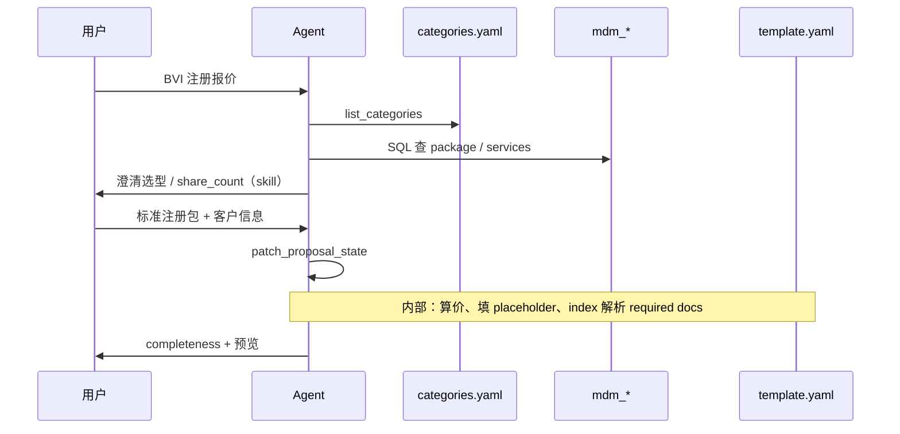
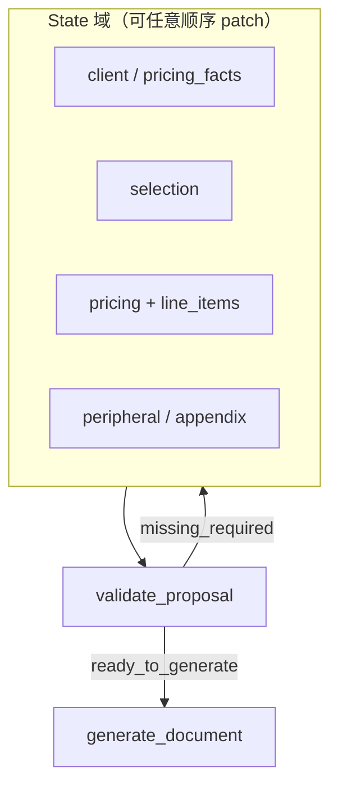
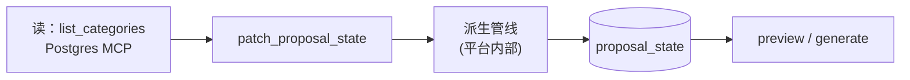

# Proposal Composer Agent — 设计方案

> 状态：**设计稿（未实施）**  
> Category 契约：[docs/proposal-composer/CATEGORY_SCHEMA.md](../docs/proposal-composer/CATEGORY_SCHEMA.md)（设计参考，非运行时加载）

---

## 1. 定位

BD/销售出具 Proposal 需要：选对 **region × BU** 的产品目录、组合服务/套餐、联动周边知识（required doc、credential、terms 等），并支持多种对话路径。



| 输入 | 职责 |
|------|------|
| **产品目录（MDM 模拟）** | 能卖什么、多少钱（`mdm_services` / `mdm_packages`，MCP 直查） |
| **Category 路由** | 选哪个 region×BU、默认 template（`manifest.yaml`，几行） |
| **Knowledge 索引** | 选型 → required doc 等（`knowledge-index.yaml`） |
| **知识仓库** | `peripheral/`、`templates/*/blocks/` |

**原则**：一套 Category Schema、一套图 Schema；region 差异只体现在字段值与图中节点实例，不为 region 写 agent 分支。

---

## 2. Category 与 Template

```
category_id = Region × BU
```

| 概念 | 作用 |
|------|------|
| **Category** | 数据作用域：services、packages、定价 |
| **Template** | 文档契约：章节、费用表分节、可选 `service_filter` |

**何时需要多个 Template**：仅当存在真实结构差异（如 AU Audit 限制 ADT 前缀 SKU）。  
**何时不需要**：同一 category 下不同 package/service 组合（如 BVI Incorporation vs Transfer-in）——共用 template，靠选型 + 条件渲染区分。

| category_id | Region | BU | templates | 验证重点 |
|-------------|--------|-----|-----------|----------|
| `harneys-bvi` | BVI | Harneys | `harneys-bvi`（唯一） | TIERED、`service_group`、条件渲染 |
| `sg-sme` | SG | Incorp | `sg-sme-standard` | 首单 GST、Appendix |
| `au-services` | AU | Tax + Advisory | `au-audit`、`au-advisory` | `service_filter`、scope_of_work |

Harneys 下可有多个 region（BVI、未来 Cayman），各为独立 `category_id`，template 结构可复用。

---

## 3. 数据布局

```
backend/agents/proposal-composer/knowledge/
  categories.yaml
  knowledge-index.yaml              # entries + triggers（仅找知识）
  templates/{template_id}/
    template.yaml                   # placeholder 契约
    proposal.md                     # 正文 + {{placeholders}}
    blocks/*.md
  peripheral/
```

| 内容 | 来源 |
|------|------|
| SKU / package / 定价 | PostgreSQL `mdm_*`（Postgres MCP） |
| Category 路由 | `categories.yaml` |
| 模版结构与 placeholder | `templates/{id}/template.yaml` + `proposal.md` |
| 触发型知识 | `knowledge-index.yaml` |

`list_categories` 读 `categories.yaml`；产品目录由 agent 写 SQL 查 `mdm_*`。

### Agent 主流程（Harneys BVI 示例）

Incorporation / Transfer-in **不切换 template**，只切换 package/SKU。



---

## 4. 区域差异（统一模型下的表达）

| 差异 | 表达位置 | 例 |
|------|----------|-----|
| 定价类型子集 | `mdm_services.pricing_type` 分布 | BVI: TIERED；SG: FIXED |
| 可选字段填值 | `service.*` 同 schema | BVI: `service_group` |
| 费用展示 | `template.yaml` → `solution_and_price.fee_layout` | BVI 按 `service_group`；AU 按 `department_team` |
| 首单/税/附录 | 模版 optional + state | SG 后续扩展 |
| 未收敛字段 | `service.extensions` | AU `matrix_for_proposal` |

Manifest：`knowledge/categories.yaml`。产品数据：`mdm_services` / `mdm_packages`。

---

## 5. 定价

Agent **不心算价格**；读 Category Source 后调用确定性 `compute_pricing`（Price Spec dispatch）。

| type | 用途 |
|------|------|
| FIXED / TIERED / RANGE / BASE_PLUS / BASE_PLUS_VARIABLE | BVI 主场景 |
| MATRIX_REF | AU audit 等 |
| DUAL_CURRENCY | 按需启用 |

流程：选型 → 按选中 SKU 的 `price_spec` 收集 `pricing_facts`（缺则 skill 追问）→ `compute_pricing` → 写入 `proposal_state.pricing` + `line_items`。

---

## 6. 模版与知识索引

**模版 = 静态正文 + placeholder**；生成目标 = 所有 required placeholder 已填充，用户启用的 optional 章节也已填充 → 可预览/出 PDF。

### 6.1 文件结构（每个 template_id）

```
templates/{template_id}/
  template.yaml    # placeholder 契约、optional_sections
  proposal.md      # 通用章节 + {{solution_and_price}} 等
  blocks/*.md      # static placeholder 引用的片段
```

### 6.2 Placeholder 类型

**核心原则**：Template **不**写 incorporation / annual 等业务章节；卖什么由对话 + MDM 选型写入 `state.selection`，模版只预留 **Solution & Price** 等通用坑位。

| type | 数据来源 | 例 |
|------|----------|-----|
| `state` | `proposal_state` 字段 | `client.company_name` |
| **`solution_and_price`** | **`state.selection` + `pricing.computed`**；展示层在 `fee_layout` | **`solution_and_price`**（全 region 同名） |
| `knowledge` | `knowledge-index.yaml` triggers 或 session 选用 | `knowledge.required_docs` |
| `static` | `blocks/*.md` | `static.terms` |
| `session` | 用户/agent 写入 state | `session.appendix` |

`solution_and_price` 渲染 **当前已选全部 SKU**（含 optional add-on）；BVI 用 `fee_layout.group_by: service_group` 分组，AU 用 `department_team`，并可 `include_scope_of_work: true`。

**不在 template 里写**：`fee_table.incorporation` 等按 service_group 拆开的 placeholder——那是选型结果，不是文档结构。

### 6.3 选型 vs 模版（分工）

```
对话 / SQL 查 MDM → 用户确认 → patch selection
  → compute_pricing
  → solution_and_price 渲染（按 fee_layout 分组展示）
knowledge-index triggers → required_docs（与选了哪些 SKU 有关）
optional_sections.trigger → 是否出现附加章节（如 transfer_in → additional_info）
```

### 6.4 `knowledge-index.yaml`（极简，只找知识）

```yaml
entries:
  passport-bvi:
    kind: required_doc
    path: peripheral/required-docs/BVI/passport.md
triggers:
  - match: { category_id: harneys-bvi, service_group: incorporation }
    add: [passport-bvi, utility-bill-bvi]
```

**不含**：Template、Package、Service 节点（产品在 DB）。`service_group` 来自 **已选 SKU** 的 MDM 字段，不是 template 声明。

解析：`selected_skus` → 查 `mdm_services` → 匹配 triggers → 填入 `knowledge.*`。

### 6.5 Optional sections（按 trigger，非写死业务章节）

`optional_sections` 带 `trigger`（已选 service_group / 用户 `enabled_sections`），满足才渲染 `{{#optional id}}` 块。

| template | optional | trigger 示例 |
|----------|----------|--------------|
| `harneys-bvi` | `additional_info` | `service_groups: [transfer_in]` 或用户启用 |
| `au-advisory` | `credentials`、`appendix` | 用户 `enabled_sections` |

Optional add-on **服务**仍出现在 `solution_and_price` 表格中（选型结果），不单独占 template 章节名。

### 6.6 Completeness

```yaml
completeness:
  missing_required: [client.company_name, knowledge.required_docs]
  enabled_optional_unfilled: [credentials]
  ready_to_preview: false
  ready_to_generate: false
```

扫描 `template.yaml` 中 `required: true` 的 placeholder，对照 state / resolved 缓存。

### 6.7 已实施模版

| template_id | `solution_and_price` 展示 | optional |
|-------------|---------------------------|----------|
| `harneys-bvi` | `group_by: service_group` | `additional_info` ← transfer_in |
| `au-advisory` | `group_by: department_team` + scope | credentials、appendix |

路径：`backend/agents/proposal-composer/knowledge/templates/`

---

## 7. Proposal State

会话唯一真相；结构在 `docs/schema.py` `proposalState` 基础上扩展。**State 只存「已决定什么」，不存「用户怎么说的」。**

```yaml
proposal_meta:
  category_id: harneys-bvi          # 路由根键：决定 catalog 作用域
  template_id: harneys-bvi          # 文档契约：决定章节、费用分节、service_filter
  catalog_version: "2026.06.15"
  stage: INTAKE | SCOPING | SELECTION | PRICING | PERIPHERAL | REVIEW | GENERATE
  # ↑ 粗粒度「当前焦点/完成度摘要」，不是向导锁步；见 §7.3

client: { ... }                      # 客户信息
pricing_facts: { share_count: 1 }    # 定价所需事实（由选中 SKU 的 price_spec.dimension 推导）

selection:                           # 意图层：用户/agent 选了什么卖品
  selected_packages: [PKG-BVI-INCORP-STD]
  selected_skus: [BVI-GOV-FEE, BVI-FID-INCORP]   # 含 package 展开后的 SKU

pricing:                             # 计算层：确定性引擎输出 + 人工调整
  computed: { BVI-GOV-FEE: { amount: 350, ... }, ... }
  overrides: { BVI-FID-INCORP: { amount: 2800, reason: "..." } }
  explanations: { BVI-GOV-FEE: "tier: 1 share" }
  recurring_schedule: [...]          # 如有

line_items:                          # 展示层：PDF 费用表的物化投影（可随 pricing/布局重算）
  groups: [{ group_id, display_name, rows: [{ sku, label, amount, ... }] }]

peripheral: { required_docs, credentials, team_members, template_bindings }
first_total_invoice: [...]           # SG；由 CATALOG_DERIVED 物化
appendix: [...]                      # 可选
completeness: { missing_required, ready_to_generate }
```

### 7.1 Category 与 Template 的先后与解析

| 角色 | 说明 |
|------|------|
| **category_id** | 主键：锁定 `services` / `packages` / 定价规则；manifest 仅提供路由元数据 |
| **template_id** | 次键：锁定 PDF 章节、`service_filter`、费用 layout、知识 slot |

**推荐顺序**：先定 category，再定 template。Category 决定「能卖什么」；Template 决定「怎么呈现、能选哪些子集」。

**用户先选 template 也可以**：图中 `Category --USES_TEMPLATE--> Template` 定义合法组合；`validate_proposal` 校验 `template_id` 在该边上，不依赖 manifest 列表。

| 场景 | 解析 |
|------|------|
| BVI `harneys-bvi` | `available_templates` 仅一项 → `template_id` 可随 category 自动填充，无选择障碍 |
| AU `au-services` | 两项（`au-audit` / `au-advisory`）→ 需显式选 template，或由用户意图推断（audit vs advisory） |
| 用户只说「BVI 注册」 | Agent 定 category；template 自动；package 在 SELECTION 再定 |

**不存在「先选错顺序就卡住」**：只要最终二者一致且 template ∈ available_templates 即可。1:1 的 category 可省略 template 对话。

### 7.2 selection / pricing / line_items 为何分层

Category Source 存的是 **定价规则与基准**（Price Spec），不是最终报价单。三层职责不同：

```
selection（意图）
    │  expand_package + pricing_facts
    ▼
pricing.computed（compute_pricing 确定性输出）
    │  + overrides + materialize_fee_groups(layout from 图)
    ▼
line_items（按 FeeDisplayGroup / service_group 分组后的展示行）
```

| 层 | 存什么 | 为何不合并 |
|----|--------|------------|
| **selection** | 选了哪些 package/SKU | 意图稳定；改价、改分组不必然改选型 |
| **pricing** | 每 SKU 算出的金额、override、解释 | TIERED/MATRIX 需 facts 才算数；销售可调价而不改 catalog |
| **line_items** | PDF 表格结构（组名、行序、展示 label、最终展示金额） | 同一 SKU 可落在不同 group；`render_when` 按 group 决定是否出节 |

**重算关系**：`selection` 或 `pricing_facts` / `overrides` 变更 → 重跑 `compute_pricing` → 重跑 `materialize_fee_groups` → 更新 `line_items`。`line_items` 是派生视图，不是第二份选型。

**与 `first_total_invoice` 的关系**：`pricing.computed` **不是**首单发票那种聚合计算，而是更底层的 **逐 SKU 定价结果**（`compute_pricing` 按 Price Spec 算出每个 service 的金额）。首单发票是 **第二层派生**：在已有 `pricing.computed` 上，由 `materialize_first_invoice` 按 `invoice_eligibility` + 图中 `TaxRule` 筛 eligible 行、加 GST、拼成 SG 模板 `first_total_invoice` 章节。BVI 无此节，可不物化。

```
pricing.computed（每 SKU 单价，全 region 共用）
    ├─► materialize_fee_groups → line_items（主费用表，CATALOG_PROJECTION）
    └─► materialize_first_invoice → first_total_invoice（SG 专节，CATALOG_DERIVED）
```

### 7.3 Stage：进度标签，不是向导锁步

`stage` **不强迫用户按顺序填表**。用户可以随时改 proposal 的任意部分、以任意顺序；真正约束「能不能出 PDF」的是 `completeness`（由 `validate_proposal` 按 category/template 算出 `missing_required`）。

| 概念 | 职责 |
|------|------|
| **State 各域**（`client` / `selection` / `pricing` / `peripheral` / `appendix`） | 可独立 patch 的真相数据 |
| **`completeness`** | 硬约束：缺什么、能否 `generate_document` |
| **`stage`** | 软标签：给 UI/agent 的「当前焦点」或「整体完成度摘要」，**可跳跃、可回退** |

**Agent 行为原则**：

1. 用户说什么就改什么域，**不因 `stage` 拒绝**（例如 stage=SCOPING 时用户说「换成标准注册包」→ 直接改 `selection` 并重算 pricing/line_items）
2. 每次 patch 后跑 `validate_proposal` → 更新 `completeness`；必要时重算派生字段（pricing → line_items）
3. `stage` 由 agent **推导更新**（见下），不作为前置门禁
4. 仅 `GENERATE`（或 `ready_to_generate`）需要用户明确确认

**`stage` 如何更新（推导，非用户逐步点选）**：

取「已满足前置条件的最高阶段」或「用户当前话题所在域」，二者取对用户最有用的一个。示例规则：

| 若… | 则 `stage` 至少为… |
|-----|-------------------|
| 尚无 `category_id` | INTAKE |
| 有 category，缺 client / pricing_facts | SCOPING |
| 有选型 | SELECTION |
| 主费用已 compute | PRICING |
| template 要求的 peripheral 已解析或标缺 | PERIPHERAL |
| `ready_to_generate` 且用户在核对 | REVIEW |
| 已调用 `generate_document` | GENERATE |

用户可从 REVIEW 跳回改价 → `stage` 可回到 PRICING；`stage_history` 只记轨迹，不阻止操作。

**非线性对话示例**（均可行）：

| 用户说法 | Agent 做法 |
|----------|------------|
| 「BVI 标准注册包，客户 ABC，1 股」一句说完 | 同时写 selection + client + pricing_facts → 一次 compute → `stage` 可能直接到 PRICING |
| 「先把 team bio 换成 John」 | 只 patch `peripheral`；pricing 不动 |
| 「政府费按 2 股重算，附录晚点再填」 | 改 `pricing_facts` + 重算；`completeness` 仍标 appendix 缺失，允许继续聊 |
| 「先出个草稿 PDF 给客户看」 | 若 `validate` 允许 draft 模式则生成；否则说明还缺 `missing_required` |



Stage 名全局统一（不按 region 分叉）。Region 差异只影响 `validate_proposal` 的 **各域必填项**，不影响用户操作顺序。

| stage 标签 | 通常关联的域（非门禁） | 典型工具 |
|------------|------------------------|----------|
| INTAKE | `proposal_meta.category_id` | `get_category_manifest` |
| SCOPING | `client`、`pricing_facts` | 澄清对话 |
| SELECTION | `selection` | `expand_package`、`search_services` |
| PRICING | `pricing`、`line_items` | `compute_pricing`、`materialize_fee_groups` |
| PERIPHERAL | `peripheral`、`appendix` | `resolve_knowledge` |
| REVIEW | 全域核对 | `validate_proposal`、`render_preview` |
| GENERATE | 出件 | `generate_document` |

**加载已有 proposal（改单）**：恢复 state 后 `stage` 常为 REVIEW；用户可改任意域，不要求从 INTAKE 重来。

---

## 8. Agent 实施清单

### 8.1 目录

```
backend/agents/proposal-composer/
  profile.yaml
  system_prompt.md
  knowledge/                # 见本 agent README
  skills/
    proposal-composer/       # 单 skill：SQL 选型 + patch + completeness
```

### 8.2 Tools（State 为中心）

**原则**：`proposal_state` + JSON Schema 是核心；LLM **只 patch 可写字段**，确定性派生（定价、分组、知识解析、完整性）由 **平台在 write 时自动跑**，不暴露为一串独立 tool。这样 tool 面从 ~15 个收敛到 **读外部数据 + 改 state + 出件** 三类。



#### Schema 分工

| 标记 | 字段示例 | 谁写 |
|------|----------|------|
| 可写（agent patch） | `client`、`pricing_facts`、`selection`、`pricing.overrides`、`appendix` | LLM 通过 `patch_proposal_state` |
| 派生（`x-derived`） | `pricing.computed`、`line_items`、`first_total_invoice`、`peripheral`、`completeness`、`stage` | 平台管线；patch 响应里返回，LLM 不可直接写 |
| 校验 | 全对象 | 每次 patch 后 JSON Schema + `validate_proposal` 规则 |

派生触发（平台内部，非 LLM 编排）：

| patch 触及 | 自动重算 |
|------------|----------|
| `proposal_meta.category_id` / `template_id` | 校验 template ∈ available_templates；清空不兼容 selection |
| `selection` | `expand_package` → `compute_pricing` → `resolve_placeholders`（fee_table + knowledge index） |
| `pricing_facts` / `pricing.overrides` | `compute_pricing` → `resolve_placeholders` |
| `enabled_sections` | 重算 optional placeholder |
| 任意 patch | 更新 `completeness`、`stage`（推导） |

LLM **不必记得**「先 compute 再 materialize 再 resolve」——和「用户可乱序改 state 各域」一致，顺序由平台保证。

#### Tool 清单（精简后）

| 类别 | Tool | 说明 |
|------|------|------|
| **读 — Category** | `list_categories` | `categories.yaml` |
| **读 — Catalog** | `postgres_*`（MCP） | LLM 写 SQL 查 `mdm_*` |
| **State** | `get_proposal_state` | 含 `resolved_placeholders`、`completeness` |
| **State** | `patch_proposal_state` | 写 state → 内部算价 + 填 placeholder |
| **出件** | `render_preview`、`generate_document` | 解析 `proposal.md` 替换占位符 |

**patch 内部（非 LLM tool）**：`compute_pricing`、`resolve_knowledge_index`、`fill_placeholders`、`scan_completeness`。

可选：`patch_proposal_state` 支持 **语义操作**（仍是一次 patch，只是平台解析）以减少 agent 步数，例如：

```json
{ "op": "select_packages", "package_ids": ["PKG-BVI-INCORP-STD"] }
{ "op": "set_client", "client": { "company_name": "ABC Ltd" } }
```

#### 与旧清单对比

| 旧设计 | State-centric |
|--------|---------------|
| LLM 编排 6+ 个派生 tool | 一次 patch，平台跑管线 |
| 易漏步骤 / 顺序错乱 | 派生顺序平台固定 |
| tool 描述占 context | skill 聚焦「改哪些字段、何时读 catalog」 |
| 保留 | category/graph/knowledge **读** tool；出件 tool |

实施上 `compute_pricing` 等仍是 **平台函数**，只是挂在 `patch_proposal_state` 的 hook 里，不注册进 agent `allowed_tools`。

#### 派生管线（平台内部）

`patch_proposal_state` 合并 patch 后：

```
expand_selection → compute_pricing → resolve_placeholders → scan_completeness
```

- `resolve_placeholders` 读 `template.yaml` + `knowledge-index.yaml`，写入 `resolved_placeholders`
- `scan_completeness` 对照 required placeholder 与 `enabled_sections`

Region 差异只体现在 **模版文件**（如 SG 增加 `fee_table:first_invoice`），不靠图节点。

### 8.3 对话策略（Skill 引导，不写入 State）

用户开场方式无法枚举，**不得在 `proposal_meta` 存 `invocation_mode` 之类字段**。Agent 根据当前 utterance + 已有 state **运行时决定**下一步，原则如下：

| 信号（示例，非穷举） | Agent 策略 |
|---------------------|------------|
| 已给 SKU/Package 名 | 尽快 SELECTION → PRICING，缺 facts 再补问 |
| 模糊需求（「BVI 注册多少钱」） | INTAKE/SCOPING → 推荐 package |
| 只要主费用、不要周边 | PRICING 后跳过或精简 PERIPHERAL（由 template 缺 section 自然收敛） |
| 上传/引用已有 proposal | 加载 state，`stage` → REVIEW，定向 patch |
| 续费/版本对比 | 对比 `catalog_version`，高亮 diff |

上述模式写在 **skill / system_prompt** 里作启发式，**不是** state schema 的枚举。用户可随时改任意 state 域；**仅以 `completeness.missing_required` 约束出件**，不以 `stage` 顺序拦截。

### 8.4 已实施模版要点

**通用**：`proposal.md` 含 **Solution and pricing** → `{{solution_and_price}}`；选型不在 template 里写 service_group 名。

**`harneys-bvi`**：`fee_layout.group_by: service_group`；required docs 由 index；optional `additional_info` 在 transfer_in 或用户启用时出现。

**`au-advisory`**：`fee_layout.group_by: department_team`，`include_scope_of_work: true`；optional credentials / appendix 由用户启用。

---

## 9. 数据供给

```
上游 Excel / 未来 MDM API
    → seed_mdm_catalog.py（开发期）
    → PostgreSQL mdm_services / mdm_packages（产品目录）
    → agent MCP postgres 查 SKU / package
templates/{id}/template.yaml + proposal.md
knowledge-index.yaml → 触发型知识
skills/ → 对话与 SQL 选型
```

| 阶段 | 对接方式 |
|------|----------|
| **现在** | 产品：`mdm_*`；路由：`categories.yaml`；模版：`templates/`；知识：`knowledge-index.yaml` |
| **未来** | MDM API 替换 DB 产品表；manifest 仍可为 agent 侧轻量路由（或并入 profile） |

表定义：`backend/alembic/versions/006_mdm_catalog_tables.py`。  
导入说明：`backend/app/mdm/README.md`。

---

## 10. 实施路线

| 阶段 | 交付 |
|------|------|
| P0 | `harneys-bvi` + `au-advisory` 模版 + `knowledge-index` + skill + state/patch |
| P1 | `patch` 派生管线 + `render_preview` |
| P2 | `sg-sme` 模版 + 首单 GST |
| P3 | `generate_document` |

---

## 11. 约束

| 项 | 说明 |
|----|------|
| 单 category per proposal | 跨 BU 合并报价需独立 proposal 或后续扩展 |
| 模版与 index 手工维护 | 新增 required doc：peripheral 文件 + `knowledge-index` trigger |

---

## 附录：上游 MDM（非本 agent 范围）

MDM 维护 SKU、Package。导出进 `mdm_*`；模版 placeholder 引用 catalog 字段与算价结果。字段映射见 [CATEGORY_SCHEMA.md](./proposal-composer/CATEGORY_SCHEMA.md)。

现有 `proposalState`（`docs/schema.py`）字段：`first_total_invoice`、`appendix`、`proposal_type` → 迁移为 `category_id`。
