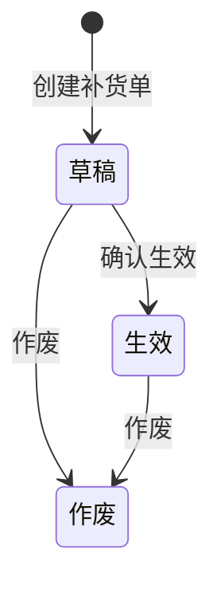

# 履约中心 — 分仓补货单 API

> 对接说明 · 2026-07-08  
> Base URL：`/api/v1`  
> 模块前缀：`/api/v1/fulfillment`

本文档仅描述 **补货单** 的创建、确认生效、作废三个接口，供外部系统对接使用。

---

## 1. 通用约定

| 项 | 说明 |
|----|------|
| 协议 | HTTPS / HTTP |
| 编码 | UTF-8 |
| 请求体 | `Content-Type: application/json` |
| 时间格式 | ISO 8601，建议带时区，如 `2026-07-13T08:00:00+08:00` |
| 补货单标识 | `id` 与 `replenishment_order_no` 相同，均为 UUID 字符串；对接时任选其一即可 |

### 补货单状态 `status`

| 取值 | 说明 |
|------|------|
| `草稿` | 创建后的初始状态 |
| `生效` | 已确认，可参与后续履约流程 |
| `作废` | 终态，不可再变更 |



### 错误响应

HTTP `400` 时响应体：

```json
{ "error": "错误说明" }
```

---

## 2. 补货单对象（响应字段）

创建、确认生效、作废接口返回的单据结构一致，核心字段如下：

| 字段 | 类型 | 说明 |
|------|------|------|
| `id` | string | 补货单唯一标识（UUID） |
| `replenishment_order_no` | string | 补货单号，与 `id` 相同 |
| `status` | string | `草稿` / `生效` / `作废` |
| `product_code` | string | 商品编码 |
| `sku_code` | string | SKU 编码 |
| `product_name` | string | 商品名称（系统根据商品主数据带出） |
| `unit` | string | 单位，默认 `EA` |
| `business_unit` | string | 事业部 |
| `transfer_qty` | number | 补货数量 |
| `gross_weight_per_ton` | number | 单件毛重（吨） |
| `total_gross_weight_ton` | number | 总毛重（吨） |
| `net_weight_per_ton` | number | 单件净重（吨） |
| `total_net_weight_ton` | number | 总净重（吨） |
| `volume_m3` | number | 单件体积（m³） |
| `total_volume_m3` | number | 总体积（m³） |
| `temp_zone` | string | 温区，如 `常温` / `冷藏` / `冷冻` |
| `initial_ship_warehouse` | string | 初始发货仓 |
| `outbound_logic_warehouse` | string | 调出逻辑仓 |
| `transit_warehouse` | string | 中转仓，无则 `-` |
| `inbound_logic_warehouse` | string | 调入逻辑仓 |
| `merchant_order_no` | string \| null | 商家订单号 |
| `source_order_no` | string \| null | 来源单号 |
| `planned_ship_at` | string \| null | 拟定发货时间 |
| `expected_arrival_at` | string \| null | 期望到货时间 |
| `shipping_remark` | string \| null | 发运备注 |
| `ecommerce_barcode` | string \| null | 电商条码 |
| `created_at` | string \| null | 创建时间 |
| `updated_at` | string \| null | 更新时间 |

**响应示例（节选）：**

```json
{
  "id": "3d8bf0fe-c78b-4e34-8a23-103e950faf26",
  "replenishment_order_no": "3d8bf0fe-c78b-4e34-8a23-103e950faf26",
  "status": "草稿",
  "product_code": "MOCK_YLP001",
  "sku_code": "MOCK_YLP001",
  "product_name": "伊利牛奶片32g原味(袋装)",
  "business_unit": "成人营养品事业部",
  "transfer_qty": 1200,
  "initial_ship_warehouse": "天津基地仓一盘货仓",
  "outbound_logic_warehouse": "天津基地仓一盘货仓",
  "inbound_logic_warehouse": "郑州销售仓一盘货仓",
  "transit_warehouse": "-",
  "temp_zone": "常温",
  "planned_ship_at": "2026-07-13T08:00:00+00:00",
  "expected_arrival_at": "2026-07-15T08:00:00+00:00",
  "created_at": "2026-07-08T06:30:00+00:00",
  "updated_at": "2026-07-08T06:30:00+00:00"
}
```

---

## 3. 创建补货单

创建成功后，补货单状态为 **`草稿`**。

### `POST /api/v1/fulfillment/branch-replenishment`

#### 请求体

| 字段 | 必填 | 类型 | 说明 |
|------|------|------|------|
| `product_code` | 是 | string | 商品编码，须在商品主数据中存在 |
| `initial_ship_warehouse` | 是 | string | 初始发货仓 |
| `outbound_logic_warehouse` | 是 | string | 调出逻辑仓 |
| `inbound_logic_warehouse` | 是 | string | 调入逻辑仓 |
| `transfer_qty` | 是 | number | 补货数量，须 > 0 |
| `planned_ship_at` | 是 | string | 拟定发货时间 |
| `expected_arrival_at` | 是 | string | 期望到货时间 |
| `business_unit` | 是 | string | 事业部 |
| `sku_code` | 否 | string | 默认等于 `product_code` |
| `merchant_order_no` | 否 | string | 商家订单号 |
| `source_order_no` | 否 | string | 来源单号 |
| `transit_warehouse` | 否 | string | 默认 `"-"` |
| `shipping_remark` | 否 | string | 发运备注 |
| `temp_zone` | 否 | string | 默认 `"常温"` |

#### 请求示例

```json
{
  "product_code": "MOCK_YLP001",
  "initial_ship_warehouse": "天津基地仓一盘货仓",
  "outbound_logic_warehouse": "天津基地仓一盘货仓",
  "inbound_logic_warehouse": "郑州销售仓一盘货仓",
  "transfer_qty": 1200,
  "planned_ship_at": "2026-07-13T08:00:00+08:00",
  "expected_arrival_at": "2026-07-15T08:00:00+08:00",
  "business_unit": "成人营养品事业部",
  "source_order_no": "OIP-SR-20260713001",
  "temp_zone": "常温"
}
```

#### 响应

| HTTP | 说明 |
|------|------|
| `201` | 创建成功 |
| `400` | 参数或业务校验失败 |

**成功响应 `201`：**

```json
{
  "item": { }
}
```

`item` 为完整补货单对象（见 §2），`status` 为 `草稿`。

**常见错误 `400`：**

```json
{ "error": "调拨数量必须大于 0" }
```

```json
{ "error": "未找到商品主数据: MOCK_XXX" }
```

---

## 4. 确认生效（草稿 → 生效）

将 **`草稿`** 状态的补货单批量确认为 **`生效`**。  
已是 `生效` 或 `作废` 的单据不会更新，记录在 `skipped` 中。

### `POST /api/v1/fulfillment/branch-replenishment/generate-transfer`

#### 请求体

| 字段 | 必填 | 类型 | 说明 |
|------|------|------|------|
| `ids` | 是 | string[] | 补货单 `id` 列表，非空；服务端去重 |

#### 请求示例

```json
{
  "ids": [
    "3d8bf0fe-c78b-4e34-8a23-103e950faf26",
    "6288e602-239f-4cf5-b7a5-a43a7c6951db"
  ]
}
```

#### 可执行条件（逐条）

| 当前 `status` | 结果 |
|---------------|------|
| `草稿` | 更新为 `生效` |
| `生效` | 跳过，`reason`: `已是生效状态` |
| `作废` | 跳过，`reason`: `已作废，不可确认生效` |
| 不存在 | 跳过，`reason`: `记录不存在` |

#### 响应

| HTTP | 说明 |
|------|------|
| `200` | 请求已处理（含部分成功） |
| `400` | 请求不合法 |

**成功响应 `200`：**

```json
{
  "updated_count": 1,
  "items": [
    {
      "id": "3d8bf0fe-c78b-4e34-8a23-103e950faf26",
      "replenishment_order_no": "3d8bf0fe-c78b-4e34-8a23-103e950faf26",
      "status": "生效"
    }
  ],
  "skipped": [
    {
      "id": "6288e602-239f-4cf5-b7a5-a43a7c6951db",
      "reason": "已是生效状态"
    }
  ]
}
```

- `updated_count`：成功更新条数  
- `items`：成功更新的完整补货单对象列表  
- `skipped`：未处理的 id 及原因；**部分成功时 HTTP 仍为 200**

**错误 `400`：**

```json
{ "error": "ids 不能为空" }
```

---

## 5. 作废

将 **`草稿`** 或 **`生效`** 状态的补货单批量作废为 **`作废`**。  
已是 `作废` 的单据跳过。

### `POST /api/v1/fulfillment/branch-replenishment/invalidate`

#### 请求体

| 字段 | 必填 | 类型 | 说明 |
|------|------|------|------|
| `ids` | 是 | string[] | 补货单 `id` 列表，非空；服务端去重 |

#### 请求示例

```json
{
  "ids": ["3d8bf0fe-c78b-4e34-8a23-103e950faf26"]
}
```

#### 可执行条件（逐条）

| 当前 `status` | 结果 |
|---------------|------|
| `草稿` / `生效` | 更新为 `作废` |
| `作废` | 跳过，`reason`: `已是作废状态` |
| 不存在 | 跳过，`reason`: `记录不存在` |

#### 响应

| HTTP | 说明 |
|------|------|
| `200` | 请求已处理（含部分成功） |
| `400` | 请求不合法 |

**成功响应 `200`：**

```json
{
  "updated_count": 1,
  "items": [
    {
      "id": "3d8bf0fe-c78b-4e34-8a23-103e950faf26",
      "replenishment_order_no": "3d8bf0fe-c78b-4e34-8a23-103e950faf26",
      "status": "作废"
    }
  ],
  "skipped": []
}
```

**错误 `400`：**

```json
{ "error": "ids 不能为空" }
```

---

## 6. 对接流程示例

```text
1. POST /branch-replenishment          → 得到 id，status=草稿
2. POST /branch-replenishment/generate-transfer  → 传入 id，status=生效
3. （如需取消）POST /branch-replenishment/invalidate → status=作废
```

外部系统保存第 1 步返回的 `id`（或 `replenishment_order_no`），用于后续确认生效或作废。
