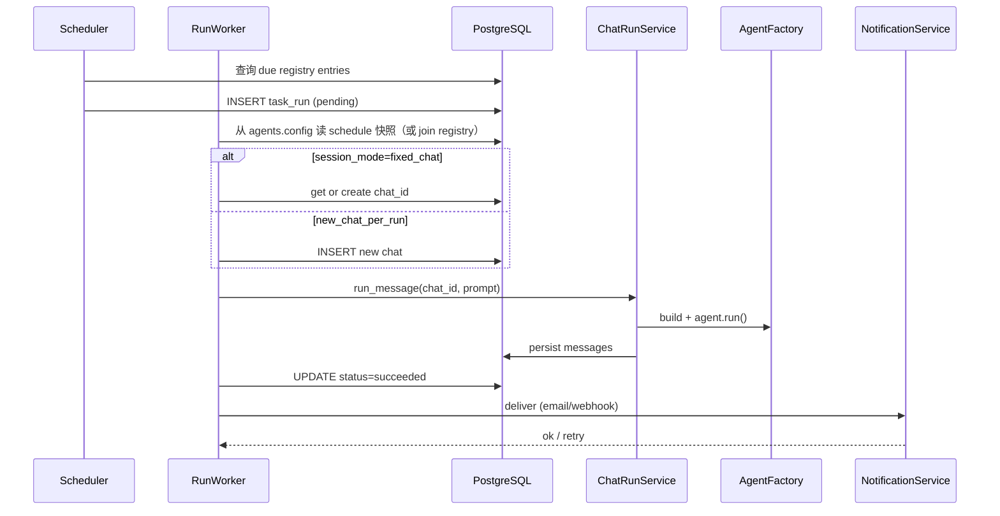

# 定时任务 Agent 设计方案

> **状态**：设计稿（Design Only）  
> **日期**：2026-07-02  
> **范围**：在 **Platform 层** 为 Agent 增加**定时触发入口**（scheduled invoke）；Agent 本身不分「对话型 / 任务型」；**不修改任何现有 agent profile**。

---

## 0. 方案摘要

| 维度 | 设计 |
|------|------|
| **核心模型** | **一个 Agent，多种触发入口** — Chat（已有）+ Cron（新增）；不是两类 Agent |
| **Cron 本质** | Platform 的 **scheduled invoke hook**：到点调用同一套 `AgentFactory` + `run_message(prompt)` |
| **Hybrid** | 某 agent profile 含可选 `schedule` 块 **且** Chat 仍可用 → 自然成立，无需 `hybrid` 类型标签 |
| **现有 agent** | 无 `schedule` 块 → 仅 Chat 入口；profile **零改动**，行为不变 |
| **配置** | `profile.yaml` 可选 `schedule` / `schedules`（与 model、hooks 同级） |
| **DB registry** | 仅有 schedule 配置的 agent 写入 registry；供 Scheduler 索引 + 运行历史 |
| **UI** | Chat 列表：默认全部 agent；**Schedules 看板**：列出「配置了 schedule 的 agent」及其 run 历史 |
| **仅定时、不进 Chat 列表** | 可选 `ui.chat_picker: false`（展示偏好），**不是** Agent 类型 |

---

## 1. 背景与目标

### 1.1 用户诉求

用户希望平台支持**定时任务 Agent**，典型场景包括：

- 编写一个 prompt 或 skill，要求 Agent 每天早上 X 点自动运行（例如搜索网络、汇总行业动态）
- 执行结果呈现在 **Agent 对话框**（新建或追加到固定 Chat）
- 或通过 **邮件** 等方式投递输出

### 1.2 设计原则

| 原则 | 说明 |
|------|------|
| **零侵入** | 现有 agent 无 `schedule` → Scheduler 不注册；Chat 路径不变 |
| **触发与认知分离** | Cron 只负责「何时、用什么 prompt 调用」；Agent 运行时与 Skill 不变 |
| **Platform 增量** | Scheduler、registry、scheduled invoke 服务；`stream_message` 不重构 |
| **复用执行引擎** | Scheduled invoke → `ChatRunService.run_message()` + `AgentFactory` |
| **Profile 可选块** | `schedule` 是 agent 上的**可选触发配置**，不是 agent 分类 |
| **配置分层** | `schedule.prompt` = 触发语；Skill = 业务方法论 |

### 1.3 非目标（本阶段）

- **不修改** `backend/agents/` 下任何现有 agent 的 profile、prompt、skill
- MVP 可不往现有 agent 加 `schedule`（加 schedule = 启用 hybrid，随时可 opt-in）
- 不做通用工作流编排器（对标 n8n / Zapier 全功能）
- 不在 MVP 中实现 Human-in-the-loop 审批流

---

## 2. 现有平台架构摘要

### 2.1 技术栈

```
Frontend (React + Vite)
    ↕ REST + SSE
Backend (FastAPI + uvicorn)
    ↕
PostgreSQL (持久化) + Redis (Session 缓存，可选)
    ↕
Microsoft Agent Framework (MAF)
    ↕
MCP Servers (postgres, search, …) + Builtin Tools
```

Agent 定义采用**文件配置**，启动时由 `platform_sync` 同步到 PostgreSQL：

```
backend/agents/<slug>/
  profile.yaml          # 模型、MCP、hooks、allowed_tools
  system_prompt.md
  mcp_servers.yaml
  skills/<name>/SKILL.md
```

### 2.2 当前 Agent 执行路径

用户在前端 Chat 中发消息 → `POST /api/v1/chats/{id}/stream`（SSE）→ `ChatRunService.stream_message()`：

1. 持久化 user message
2. `AgentFactory.build()` 组装 MAF Agent（model + middleware + MCP tools + skills）
3. `agent.run(input, session, stream=True)`
4. 流式事件回传前端；最终 assistant 消息写入 `messages` 表

**Headless 入口已存在**：`ChatRunService.run_message()` 适合作为 **scheduled invoke 的 callback** — 与 `stream_message()` 共用 build/run/persist，只是非 SSE。

### 2.3 现有能力可直接复用

| 能力 | 位置 | 定时任务用途 |
|------|------|-------------|
| Agent 构建 | `agent_factory.py` | Scheduled invoke 与 Chat **同一** build 路径 |
| 非流式执行 | `chat_run.py::run_message` | **Scheduled invoke callback** |
| 会话/记忆 | `SessionStore` | `fixed_chat` 模式下 cron 追加同 Chat |
| Skill | `agents/*/skills/` | invoke prompt 触发 skill；与 Chat 共用 |
| Hooks / MCP | `hook_catalog` / `mcp_registry` | 与 Chat 共用，无单独「task 运行时」 |

### 2.4 当前缺口

| 缺口 | 影响 |
|------|------|
| 无 Scheduler / invoke 管线 | Cron 无法到点调用 agent |
| 无 schedule 数据模型 | 无法持久化 cron 与 run 历史 |
| `profile_loader` 未解析 `schedule` | 无法从 profile 注册 cron |
| 无通知通道 | 无法邮件 / Webhook 投递 |

### 2.5 触发模型（非 Agent 类型）

**结论**：Cron 不是「第二类 Agent」，而是 Platform 提供的 **scheduled invoke 触发器**，在指定时刻调用**已有 Agent 运行时**。

```
                    ┌─────────────────────────────────┐
                    │   Agent（单一实体，profile）      │
                    │   AgentFactory + skills + MCP   │
                    └───────────────┬─────────────────┘
                                    │
          ┌─────────────────────────┼─────────────────────────┐
          │                         │                         │
          ▼                         ▼                         ▼
   Interactive Trigger      Scheduled Trigger          (future)
   POST …/stream            Cron → invoke service       Webhook / manual
   用户消息 → input          schedule.prompt → input     …
          │                         │
          └─────────────┬───────────┘
                        ▼
              ChatRunService.run_message / stream_message
                        ▼
                   agent.run(…)
```

| 概念 | 是什么 | 不是什么 |
|------|--------|----------|
| **Agent** | 一套 model + prompt + skills + tools | 没有「对话版 / 任务版」两套运行时 |
| **`schedule` profile 块** | 该 agent 的 **cron 触发器配置** | 不是把 agent 标记为 task type |
| **Hybrid** | 同一 agent **同时**有 Chat 入口 + `schedule` 块 | 不是第三种 agent 类型，无需 `hybrid` 枚举 |
| **`ui.chat_picker: false`** | 不在 Chat 列表展示（可选） | 不是 agent 类型；定时 invoke 仍可用 |

**向后兼容**：

```text
profile 无 schedule
  → 仅 Interactive trigger
  → Scheduler 忽略该 agent
  → 与今天完全一致

profile 有 schedule
  → 注册 cron → ScheduledInvokeService → run_message(agent_id, rendered_prompt)
  → Chat trigger 仍可用（除非 ui.chat_picker: false）
```

**与 LangGraph / Lindy 对齐**：行业实践是 **Trigger → 同一 Assistant/Graph**，而非「Schedule 专用 Assistant 类型」。

**`profile_loader` 衔接**：

1. 解析可选 `schedule` / `schedules` → `AgentProfile.schedules`
2. 解析可选 `ui.chat_picker`（默认 `true`）
3. **不引入** `invocation_modes` 作为类型枚举（loader 中 reserved 的 `invocation_modes` 可弃用或仅作文档别名）
4. `platform_sync.sync_agent_schedules()`：仅对 **profile 含 schedule** 的 agent upsert registry

### 2.6 现有 Agent 兼容性

| 现有 agent | MVP profile | 平台行为 |
|------------|-------------|----------|
| 全部现有 slug | **不改** | 无 `schedule` → 仅 Interactive；Chat 列表照常 |
| 未来新增带 schedule 的 agent | 新目录 | Scheduler 注册；Schedules 看板可见 |
| 未来 hybrid | 在任意 agent 上增加 `schedule` | Chat + Cron 共用同一 AgentFactory |

**Platform 层改动**（不触碰现有 profile）：

- 新增：`app/scheduler/`、`ScheduledInvokeService`、registry / runs 表
- 扩展：`profile_loader`（`schedule`、`ui`）、`platform_sync`
- 扩展：Schedules 看板；Chat 列表仍返回 `ui.chat_picker !== false` 的 agent
- **不修改**：现有 agent 的 Chat build/run 路径

---

## 3. 行业调研与最佳实践

### 3.1 主流 Agent 平台的定时模式

| 产品 / 框架 | 定时机制 | 关键设计 |
|-------------|----------|----------|
| **LangGraph Platform** | 内置 Cron API + `langgraph.json` 声明 | 支持 **stateful**（固定 thread）与 **stateless**（每次新建 thread）；`on_run_completed: keep/delete`；强调删除无用 cron 避免费用 |
| **ChatGPT Tasks** | 产品内 Scheduled Tasks | 用户用自然语言设定 schedule；结果回到 Chat 收件箱；适合单步 prompt，非复杂工作流 |
| **Lindy AI** | Trigger 节点（Schedule / Email / Webhook） | 可视化 agent builder；trigger → LLM actions → 外部集成；面向非开发者 |
| **CrewAI + n8n** | 外部 Schedule Trigger → HTTP webhook | Agent 包装为 FastAPI `/kickoff`；n8n 负责调度；长任务用 async webhook 回调 |
| **Cronhooks 等** | 外部 cron → POST webhook | 框架无关；适合 serverless；平台需暴露受保护的 trigger endpoint |

**共性模式**：

1. **Trigger 层与 Cognition 层分离** — 调度器只负责「何时触发」，Agent 运行时负责「做什么」
2. **两种 Session 策略** — 固定会话（有上下文延续）vs 每次新建（隔离 run）
3. **异步执行** — 定时 run 不占用 HTTP 连接；完成后通过 Chat / Email / Webhook 投递
4. **生命周期管理** — pause、delete、overlap policy（上次未完成时是否跳过/并行）

### 3.2 调度基础设施选型

| 方案 | 适用场景 | 优点 | 缺点 |
|------|----------|------|------|
| **APScheduler（独立 scheduler 进程）** | 中小规模、与 FastAPI 同栈 | Python 原生、cron 表达式、可持久化到 PostgreSQL job store | 分布式需 Redis 锁或单实例 scheduler |
| **Celery Beat + Redis** | 已有 Celery 生态、需队列削峰 | 成熟、可水平扩展 worker | 运维复杂；Beat 单点；Agent 长任务需自定义状态 |
| **K8s CronJob / EventBridge** | 云原生部署 | 与 API 解耦、infra 级可靠 | 需额外编排；触发粒度为 HTTP call |
| **Temporal Schedules** | 长流程、高可靠、需 catch-up | 持久化 workflow、overlap/catch-up 原生支持 | 引入 Temporal Server，过重 for MVP |

**推荐（分阶段）**：

- **Phase 1（MVP）**：**APScheduler + 独立 `scheduler` 进程** + PostgreSQL job store  
  - 与现有 FastAPI + PostgreSQL 栈一致，无需新中间件  
  - Scheduler 单实例（`replicas: 1`）或通过 Redis 分布式锁保证单 leader  
  - Worker 可与 scheduler 同进程，或拆为 `worker` 进程消费 DB 中的 pending runs

- **Phase 2（规模化）**：评估 **Celery Beat** 或 **K8s CronJob → internal API**  
  - 当定时任务量 > 数百/天、需独立扩缩 worker 时迁移

- **Phase 3（复杂编排）**：若出现多步审批、跨天补偿、严格 SLA，再引入 **Temporal**

> 参考：[LangGraph Cron Jobs](https://docs.langchain.com/langsmith/cron-jobs)、[FastAPI Background Jobs 选型](https://pub.towardsai.net/background-jobs-in-fastapi-on-eks-apscheduler-vs-celery-vs-eventbridge-what-to-pick-and-why-4a6edabc1735)

---

## 4. 产品功能设计

### 4.1 核心概念

```
Agent (profile.yaml)                    ← 单一实体，无「类型」字段
    ├── model / mcp / hooks / skills
    ├── ui.chat_picker (optional)       ← 默认 true
    └── schedule(s) (optional)          ← cron 触发器配置；有则注册 Scheduled Invoke

Scheduled Invoke（Platform 能力）
    ├── Scheduler 到点 fire
    ├── render schedule.prompt
    └── callback → ChatRunService.run_message(agent_id, …)

AgentScheduleRegistry（DB，sync 衍生）
    └── 仅有 schedule 配置的 agent 条目

AgentScheduleRun（DB）
    └── 每次 scheduled invoke 的审计 + chat_id + 输出
```

**Source of truth**：git 中的 `profile.yaml`。DB 中的 schedule registry 是 `platform_sync` 镜像 + 运行态字段（`next_run_at`、`last_run_at`、run 历史）。

### 4.2 用户故事

| ID | 作为… | 我想要… | 以便… |
|----|-------|---------|-------|
| US-1 | 开发者 | 在新 agent profile 加 `schedule` | 启用 cron 触发，无需改 agent「类型」 |
| US-2 | 平台 | 现有 agent 无 `schedule` | Chat 行为完全不变 |
| US-3 | 运维 | Schedules 看板列出「配置了 schedule 的 agent」 | 按触发器监控，非按 agent 类型 |
| US-4 | 开发者 | 未来给 `yl-worker1` 加 `schedule` | 即 hybrid：同一 agent，双入口 |
| US-5 | 开发者 | `ui.chat_picker: false` | 仅定时、不进 Chat 列表 — 组织偏好，非新类型 |
| US-6 | 开发者 | `POST …/run-now` | 手动触发 scheduled invoke，调试 prompt |

**MVP 范围**：Platform 交付 scheduled invoke 能力；repo 内现有 agent 不加 `schedule`；首个带 schedule 的 agent 为**新增目录**（可选）。

### 4.3 配置方式：`profile.yaml`

#### 4.3.1 现有 Agent — **不改动**

```yaml
# backend/agents/yl-worker1/profile.yaml — MVP 不变
id: yl-worker1
name: "YL-Worker-001"
model_provider: azure_anthropic
# 无 schedule → 无 cron；Chat 照常
```

#### 4.3.2 带 Scheduled Invoke 的 Agent（新增目录示例）

```yaml
# backend/agents/yl-daily-replenishment-worker/profile.yaml
id: yl-daily-replenishment-worker
name: "YL 分仓补货日报"
description: "每日定时跑供应链摘要"

model_provider: azure_anthropic
model: ${CLAUDE_AZURE_FOUNDRY_MODEL}
# … mcp / allowed_tools / hooks / skills 与同领域 agent 相同或复用 …

ui:
  chat_picker: false    # 可选：不进 Chat 列表；仍是同一类 Agent，只是 UI 隐藏

schedule:
  id: daily-replenishment
  enabled: true
  cron: "0 7 * * *"
  timezone: Asia/Shanghai
  prompt: |
    使用 yl-supply-chain-analytics skill，生成昨日分仓补货风险 TOP10 摘要。
  session_mode: new_chat_per_run
  overlap_policy: skip
  outputs:
    - type: chat
    - type: email
      to: "${YL_DAILY_REPORT_TO}"
      subject: "分仓补货日报 {{date}}"
```

#### 4.3.3 Hybrid — **同一 Agent 加 `schedule` 即可（未来 opt-in）**

无需 `invocation_modes` 或 `hybrid` 标签。给已有或新建 agent 增加 `schedule` 块即同时支持 Chat + Cron：

```yaml
# 未来示例：backend/agents/yl-worker1/profile.yaml（显式 opt-in 时）
id: yl-worker1
# … 现有字段 …

schedule:
  id: daily-digest
  cron: "0 7 * * *"
  timezone: Asia/Shanghai
  prompt: |
    使用 yl-supply-chain-analytics skill，生成昨日摘要。
  session_mode: fixed_chat    # 定时追加到固定 Chat，用户白天在同 Chat 追问
  outputs:
    - type: chat
```

`ui.chat_picker` 省略（默认 `true`）→ Chat 列表与 Schedules 看板**均**展示该 agent。

**MVP**：不修改 `yl-worker1`；hybrid 由 Platform 能力自然支持，产品择期再加 profile。

**独立目录 vs 同一 slug 加 schedule**：

| 做法 | 适用 |
|------|------|
| 新目录 + `ui.chat_picker: false` | 职责分离、独立部署；MVP 推荐 |
| 同一 agent 加 `schedule` | 强 hybrid、共用 session；未来 opt-in |

#### 4.3.4 单 Agent 多 Cron（可选）

若一个 worker 需一天跑多次，在 profile 内用 `schedules:` 数组：

```yaml
schedules:
  - id: morning-digest
    cron: "0 7 * * *"
    prompt: "..."
  - id: evening-alert
    cron: "0 18 * * *"
    prompt: "..."
```

解析规则：`schedule`（单对象）与 `schedules`（数组）二选一；同步时 registry key = `{agent_slug}:{schedule.id}`。

#### 4.3.5 Skill 驱动（业务逻辑层，不变）

- profile `schedule.prompt` → **触发语**（何时、用什么 skill、范围）
- `skills/*/SKILL.md` → **方法论**（SQL、维度、输出结构）
- 不在 profile 里写 SQL 细节

**命名建议（大量 scheduled job）**：

| 模式 | 目录名示例 | 说明 |
|------|-----------|------|
| 仅 Chat | `yl-worker1` | 无 `schedule` |
| 仅 Cron（UI 隐藏 Chat） | `yl-daily-*-worker` + `ui.chat_picker: false` | 组织上分离，运行时仍是 Agent |
| Hybrid | 任意 agent 加 `schedule` | 双触发入口，同一 slug |

### 4.4 输出通道设计

| 通道 | MVP | 行为 |
|------|-----|------|
| **Chat** | ✅ | 创建或追加 Chat；assistant 最终 `text` 消息可见；Chat 标题可设为 schedule name + 日期 |
| **Email** | Phase 1.5 | 取 run 最终 assistant 文本 + 可选 viz 链接；通过 SMTP / SendGrid 发送 |
| **Webhook** | Phase 2 | POST JSON `{ run_id, chat_id, summary, status }` 到用户配置的 URL |
| **Slack/Teams** | Phase 2 | 通过 webhook 或 MCP 集成 |

**Chat 展示增强（前端）**：

- Chat 列表增加 `source: scheduled` 标记或独立「定时报告」分组
- 每条 assistant 消息 metadata 含 `scheduled_run_id`，UI 可显示「由定时任务 xxx 于 08:00 生成」

---

## 5. 系统架构

### 5.1 目标架构图

```
┌─────────────────────────────────────────────────────────────────┐
│                        Frontend                                  │
│  Chat UI（全部 chat_picker agent）│  Schedules 看板 + Run 历史  │
└────────────────────────────┬────────────────────────────────────┘
                             │ REST
┌────────────────────────────▼────────────────────────────────────┐
│                     FastAPI (API 进程)                           │
│  /api/v1/agents          /api/v1/agent-schedules/*               │
│  /api/v1/schedule-runs/*                                        │
│  (现有 /chats, /stream — 不变)                                   │
└────────────────────────────┬────────────────────────────────────┘
                             │
         ┌───────────────────┼───────────────────┐
         ▼                   ▼                   ▼
┌────────────────┐  ┌────────────────┐  ┌──────────────────┐
│  PostgreSQL    │  │  Redis (lock)  │  │  Scheduler 进程   │
│  agents.config │  │                │  │  APScheduler     │
│  schedule_reg* │  │                │  │  → ScheduledInvoke│
│  schedule_runs │  │                │  │                   │
└────────────────┘  └────────────────┘  └────────┬─────────┘
                                                  │
                                                  ▼
                                        ┌──────────────────┐
                                        │ ScheduledInvokeService │
                                        │ run_message() callback │
                                        └────────┬─────────┘
                                                  ▼
                                        AgentFactory（同一运行时）

platform_sync: sync_agents_from_profiles() + sync_agent_schedules()
               （仅 profile 含 schedule 的 agent 写入 registry）
```

### 5.2 组件职责

| 组件 | 职责 |
|------|------|
| `profile_loader` | 解析 `schedule(s)`、`ui.chat_picker` |
| `platform_sync.sync_agent_schedules()` | 仅有 schedule 的 agent → registry |
| `SchedulerProcess` | 读 registry；到点调用 invoke |
| `ScheduledInvokeService` | render prompt → chat → `run_message` → notify |
| `NotificationService` | email / webhook |

### 5.3 单次 Run 时序



### 5.4 与现有 `ChatRunService` 的集成点

**推荐**：新增 thin wrapper，不修改 `stream_message` 行为：

```python
# 伪代码 — scheduled invoke callback
class ScheduledInvokeService:
    async def execute(self, run_id: UUID) -> None:
        run = await self._runs.get(run_id)
        agent = await self._agents.get(run.agent_id)
        schedule = self._resolve_schedule(agent, run.schedule_id)
        prompt = self._templates.render(schedule.prompt, run.scheduled_at)
        chat = await self._resolve_chat(agent, schedule, run)
        await ChatRunService(db).run_message(chat.id, prompt)
```

**注意点**：

- Scheduled invoke **不走 SSE**；Schedules 看板展示 run 状态
- **不修改** `stream_message`；Chat 与 Cron 共用 `AgentFactory`，仅 input 来源不同
- `ui.chat_picker: false` 只影响列表展示，**不**禁止 Chat API（若已知 chat_id 仍可访问；Phase 2 可收紧）

---

## 6. 数据模型设计

### 6.1 `agent_schedule_registry`（profile 同步表，非配置源）

| 字段 | 类型 | 说明 |
|------|------|------|
| `id` | UUID PK | |
| `agent_id` | UUID FK → agents | |
| `schedule_key` | VARCHAR(128) UNIQUE | `{agent_slug}:{schedule.id}` |
| `enabled` | BOOLEAN | profile 默认 + UI 可临时 override（`paused_until`） |
| `cron_expr` | VARCHAR(100) | 从 profile 镜像 |
| `timezone` | VARCHAR(64) | |
| `config_hash` | VARCHAR(64) | profile schedule 内容 hash；变更则 re-register job |
| `next_run_at` | TIMESTAMPTZ | scheduler 维护 |
| `last_run_at` | TIMESTAMPTZ | |
| `synced_at` | TIMESTAMPTZ | 最后 platform_sync 时间 |

**完整 schedule 定义**（prompt、outputs、session_mode）存在 `agents.config.schedule` JSONB，与现有 `extra_config` 同步模式一致——**不拆列**，避免 schema 频繁变更。

索引：`(enabled, next_run_at)`、`(agent_id)`

**Sync 行为**（类比 MCP/Skill 同步）：

1. 扫描磁盘 profile →  upsert registry
2. 磁盘已删的 schedule_key → delete registry + 取消 APScheduler job
3. `config_hash` 变化 → 热更新 cron

### 6.2 `agent_schedule_runs`（原 scheduled_runs）

| 字段 | 类型 | 说明 |
|------|------|------|
| `id` | UUID PK | |
| `registry_id` | UUID FK → agent_schedule_registry | |
| `agent_id` | UUID FK | 冗余，便于按 agent 查 |
| `schedule_id` | VARCHAR(64) | profile 内 schedule.id |
| `chat_id` | UUID FK → chats | |
| `status` | VARCHAR(32) | pending / running / succeeded / failed / skipped / cancelled |
| `scheduled_at` | TIMESTAMPTZ | |
| `started_at` / `finished_at` | TIMESTAMPTZ | |
| `prompt_rendered` | TEXT | |
| `assistant_summary` | TEXT | |
| `error_message` | TEXT | |
| `metadata` | JSONB | token、notification、duration |
| `created_at` | TIMESTAMPTZ | |

索引：`(registry_id, scheduled_at DESC)`、`(agent_id, scheduled_at DESC)`

### 6.3 UI 临时 override（可选，Phase 2）

| 字段 | 表 | 说明 |
|------|-----|------|
| `paused_until` | registry | 运维暂停，不改 git |
| `enabled_override` | registry | null =  follow profile |

**原则**：git profile 是 source of truth；UI 只做运行态开关，不做「创建新 schedule」。

### 6.3 Chat / Message 扩展（轻量）

**Option A（推荐）**：不改表结构，用 metadata：

- `chats.session_state.scheduled_task_id` — 固定会话绑定
- `messages.metadata.scheduled_run_id` — 标记消息来源

**Option B**：`chats.source` 枚举字段（`interactive` | `scheduled`）

---

## 7. API 设计（草案）

### 7.1 Agents

| 方法 | 路径 | 说明 |
|------|------|------|
| GET | `/api/v1/agents` | **不变**：返回 `ui.chat_picker !== false` 的 agent（默认全部现有 agent） |
| GET | `/api/v1/agents/{id}` | 可选增加 `schedules` 字段（无 schedule 则为 null） |

### 7.2 Agent Schedules（配置了 cron 的 agent）

| 方法 | 路径 | 说明 |
|------|------|------|
| GET | `/api/v1/agent-schedules` | 所有 registry 条目（= profile 含 schedule 的 agent） |
| GET | `/api/v1/agent-schedules/{agent_slug}` | 某 agent 的 schedule + 最近 runs |
| POST | `/api/v1/agent-schedules/{agent_slug}/run-now` | 手动触发 invoke（可选 `schedule_id`） |
| POST | `/api/v1/agent-schedules/{agent_slug}/pause` | 暂停 cron |
| POST | `/api/v1/agent-schedules/{agent_slug}/resume` | 恢复 |

Agent 详情示例：

```json
{
  "slug": "yl-daily-replenishment-worker",
  "ui": { "chat_picker": false },
  "schedules": [{ "id": "daily-replenishment", "cron": "0 7 * * *", "outputs": [] }]
}
```

### 7.3 Schedule Runs

| 方法 | 路径 | 说明 |
|------|------|------|
| GET | `/api/v1/schedule-runs?agent_slug=` | 运行历史 |
| GET | `/api/v1/schedule-runs/{id}` | 单次详情 |
| POST | `/api/v1/schedule-runs/{id}/cancel` | 取消进行中的 invoke |

### 7.3 内部 API（可选）

| 方法 | 路径 | 说明 |
|------|------|------|
| POST | `/internal/scheduler/tick` | K8s CronJob 触发；需 service token |

---

## 8. 调度器详细设计

### 8.1 进程模型

```bash
# 新增启动入口（与 uvicorn 并列）
python -m app.scheduler.main
# 或
uvicorn app.scheduler.app:app  # 若 scheduler 也暴露 health/metrics
```

`scripts/start.sh` 增加可选第三进程 `scheduler.log`。

### 8.2 触发流程

1. **启动**：从 DB 加载 `enabled=true` 的 tasks，注册 APScheduler jobs
2. **Tick**：job fire → 检查 `overlap_policy`（若上次 running 则 skip）
3. **Enqueue**：INSERT `scheduled_runs` (pending)
4. **Execute**：async worker 执行（单 run 串行 per task，或全局 concurrency limit）
5. **Complete**：更新 next_run_at；失败按策略 retry（如 3 次 exponential backoff）

### 8.3 Cron 与时区

- 存储：`cron_expr` + `timezone`（与 LangGraph 一致，避免 UTC 混淆）
- UI 展示：本地时区 + UTC 对照
- 使用 `croniter` 或 APScheduler 的 `CronTrigger(timezone=...)`

### 8.4 幂等与防重复

- 唯一约束：`(scheduled_task_id, scheduled_at)` — 同一 tick 只一条 run
- 分布式：Redis `SETNX scheduler:leader` TTL 30s，仅 leader 注册 jobs
- 进程重启：从 DB 恢复 jobs；status=running 超过 N 分钟标记 failed 并允许重跑

### 8.5 Missed Run 策略

| 策略 | 行为 |
|------|------|
| `skip`（默认） | 宕机期间错过的 tick 不补跑 |
| `catch_up`（Phase 2） | 恢复后补跑最近 K 次 |

---

## 9. 通知层设计

### 9.1 Email（Phase 1.5）

```python
# 配置（.env）
SMTP_HOST=
SMTP_PORT=
SMTP_USER=
SMTP_PASSWORD=
EMAIL_FROM=noreply@example.com
```

- 模板：Markdown → HTML 简易转换
- 内容：assistant 最终文本 + 「在平台查看」deep link（`/chats/{chat_id}`）
- 失败：写入 `scheduled_runs.metadata.notification_status`；可选 retry queue

### 9.2 Webhook（Phase 2）

```json
{
  "event": "scheduled_run.completed",
  "run_id": "...",
  "task_id": "...",
  "chat_id": "...",
  "status": "succeeded",
  "summary": "...",
  "finished_at": "2026-07-02T08:05:00+08:00"
}
```

HMAC-SHA256 签名头 `X-Schedule-Signature`。

---

## 10. 安全与权限

| 项 | 设计 |
|----|------|
| 认证 | Schedule CRUD 需登录用户；run 仅 owner 可见 |
| 授权 | Task 绑定 `user_id`；Agent 需用户有使用权（当前 dev 阶段可简化） |
| Prompt 注入 | 模板变量白名单；禁止用户 schedule 调用任意 agent 的 admin 工具 |
| 工具限制 | 可为 scheduled run 增加 `AllowedToolsMiddleware` 变体或 profile 标记 `scheduled_allowed_tools` |
| 费用控制 | per-user 每日 run 上限；单 task 超时（如 10min）强制 cancel |
| 密钥 | Email SMTP 走 env；webhook secret 存 DB 加密 |

---

## 11. 可观测性

| 能力 | 实现 |
|------|------|
| 结构化日志 | `scheduled_run_id`、`task_id`、`agent_slug` 贯穿 |
| Metrics | `scheduled_runs_total{status}`、`run_duration_seconds` |
| Admin 视图 | Run 列表 + 错误栈 + prompt_rendered |
| Dead man's switch | 可选对接 Healthchecks.io：task 每日应 success 至少一次 |
| Audit | 复用现有 `AuditMiddleware`；新增 hook `scheduled_run_audit` |

---

## 12. 前端 UX 要点

### 12.1 Chat 侧 — **不变**

- `GET /agents` 与 Chat picker 逻辑不变；`ui.chat_picker: false` 的 agent 不展示（MVP 无此类 agent 则列表与今天相同）

### 12.2 Schedules 看板 — **新增**

- 列出 **profile 含 schedule** 的 agent（非「task 类型 agent」）
- 字段：agent 名、cron、下次运行、上次状态、pause/run-now
- Hybrid agent（未来）同时出现在 Chat 与本看板

### 12.3 Run 历史

- 按 agent_slug / schedule_id 过滤
- 失败 run 一键重试（= run-now）

---

## 13. 示例场景（均不修改现有 agent）

### 场景 A：Platform 上线 + 零 agent 变更

1. 部署 Platform 改动（scheduler、registry、Schedules 页）
2. `backend/agents/*` **全部保持原样**
3. Chat、MCP、proposal 等行为与升级前一致；Schedules 看板为空

### 场景 B：新增带 schedule 的 agent（MVP 可选）

1. **新增** `agents/yl-daily-replenishment-worker/`，profile 含 `schedule` + 可选 `ui.chat_picker: false`
2. 重启 → sync 注册 cron
3. 07:00 invoke → 新 Chat；`yl-worker1` profile 不变

### 场景 C：Hybrid（Platform 原生支持，MVP 不改现有文件）

1. 未来在 `yl-worker1` 增加 `schedule` 块（opt-in）
2. 同一 AgentFactory：用户 Chat + 早 7 点 cron 追加 `fixed_chat`
3. 无需类型字段或平台迁移

---

## 14. 实施路线图

### Phase 1 — MVP（Platform only + 可选首个 worker）

**Platform（必做）**

- [ ] 解析 `schedule(s)`、`ui.chat_picker`；无 schedule 的 agent 零影响
- [ ] `sync_agent_schedules()` + registry / runs 表
- [ ] Scheduler + `ScheduledInvokeService`
- [ ] API：`agent-schedules`、`schedule-runs`、`run-now`
- [ ] 前端：Schedules 看板（可为空）

**Agent repo（可选）**

- [ ] 首个带 `schedule` 的新 agent 目录

**明确不做**

- [ ] 修改任何现有 agent profile
- [ ] 引入 `invocation_modes` agent 类型枚举
- [ ] UI 创建 / 编辑 cron

### Phase 2

- [ ] Email / Webhook outputs
- [ ] Hybrid UX（`fixed_chat` banner、同 Chat 追问）
- [ ] UI pause/resume
- [ ] opt-in 文档：如何给现有 agent 加 `schedule`

### Phase 3 — 高级能力

- [ ] Human-in-the-loop（邮件批准后再发送）
- [ ] 条件触发（仅当 DB 指标异常时 run）
- [ ] Temporal 评估（若 workflow 复杂度上升）

---

## 15. 风险与开放问题

| # | 问题 | 建议 |
|---|------|------|
| Q1 | 定时 run 是否继承 Chat 全部 history？ | `fixed_chat` 继承；`new_chat_per_run` 不继承；可配置 `memory.working_set` 轮数 |
| Q2 | 多实例部署时 scheduler 重复触发？ | Redis leader lock 或仅单 scheduler deployment |
| Q3 | MCP 子进程在 worker 中的生命周期？ | 复用 `AgentBundle` AsyncExitStack；每 run 独立 build/teardown |
| Q4 | 长 run 超时？ | 配置 `max_run_seconds`；asyncio.wait_for + cancel |
| Q5 | viz/artifact 类输出如何邮件展示？ | MVP 仅 text；Phase 2 附 PNG 链接或内嵌 |
| Q6 | MVP 能否给 `yl-worker1` 加 cron？ | Platform **支持**；MVP **不改文件** — 加 `schedule` 即 hybrid |
| Q8 | 还需要 agent 类型字段吗？ | **不需要**；`schedule` 存在 = 有 cron 入口；`ui.chat_picker` 管展示 |
| Q9 | 成本归属？ | `agent_schedule_runs.metadata` 按 agent_slug 汇总 |

---

## 16. 参考

- 现有代码：`backend/app/services/chat_run.py`、`backend/app/platform/agent_factory.py`、`backend/agents/README.md`
- LangGraph Cron Jobs：https://docs.langchain.com/langsmith/cron-jobs
- LangGraph Platform Background Runs：https://www.langchain.com/blog/langgraph-platform-announce
- APScheduler vs Celery Beat：https://leapcell.io/blog/scheduling-tasks-in-python-apscheduler-vs-celery-beat
- FastAPI 后台任务选型（2026）：https://pub.towardsai.net/background-jobs-in-fastapi-on-eks-apscheduler-vs-celery-vs-eventbridge-what-to-pick-and-why-4a6edabc1735

---

## 附录 A：配置分层

| 层 | 位置 | 示例 |
|----|------|------|
| **Agent 运行时** | profile + skills | 同一套 AgentFactory |
| **Interactive 触发** | Chat API | 用户消息 |
| **Scheduled 触发** | profile → `schedule` | cron、prompt、outputs |
| **UI 展示** | profile → `ui.chat_picker` | 默认 true |
| **运行态索引** | DB registry | next_run_at |
| **每次 invoke** | DB runs + messages | 审计与 Chat |

## 附录 B：现有 Agent — MVP 不改动

全部现有 slug 无 `schedule` → 仅 Interactive 触发。新增 cron 通过新 agent 目录或未来 opt-in 加 `schedule`。

## 附录 C：`profile.yaml` 调度字段

| 字段 | 说明 |
|------|------|
| `schedule` | 单个 cron 触发器（对象） |
| `schedules` | 多个 cron（数组）；与 `schedule` 二选一 |
| `ui.chat_picker` | 默认 `true`；`false` 时不出现在 Chat 列表 |

与 `model`、`mcp_servers`、`hooks` 同级，**任意 agent** 均可选填：

```yaml
schedules:
  - id: morning-digest
    cron: "0 7 * * *"
    prompt: "..."
  - id: evening-alert
    cron: "0 18 * * *"
    prompt: "..."
```

同步时 registry key = `{agent_slug}:{schedule.id}`。这与现有「一目录一 Agent、契约进 profile、启动时 platform_sync」的模式一致。
